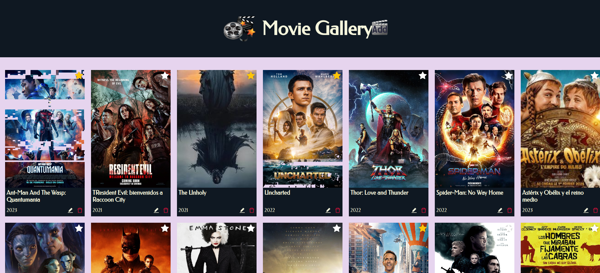
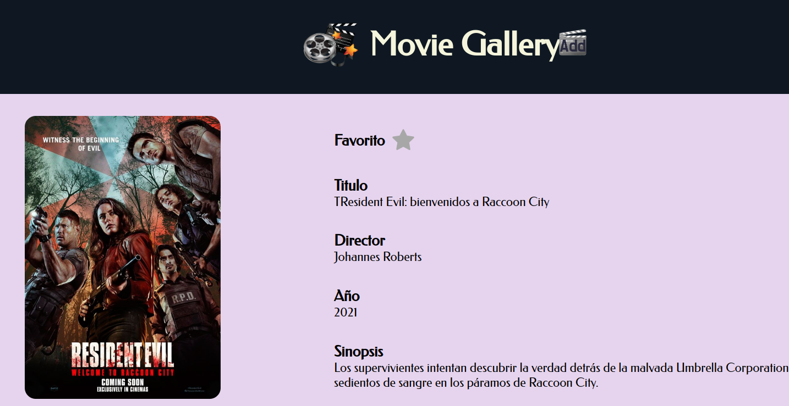
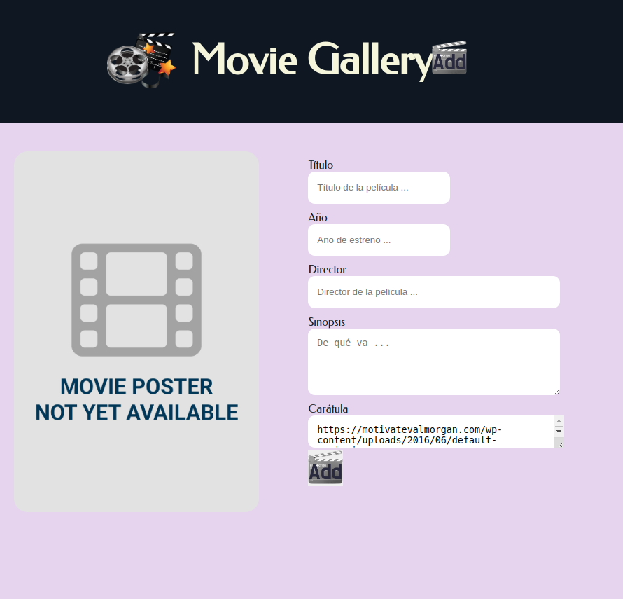
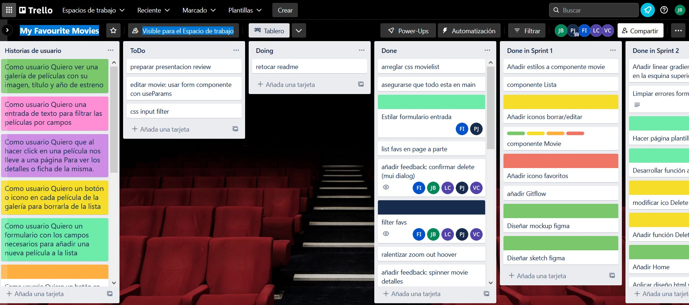
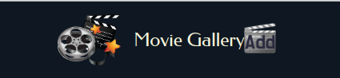
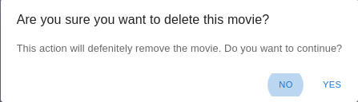

[Link a producción](https://movie-gallery-rho.vercel.app/)

## Movie Gallery

Un equipo backend de una empresa relacionada con el mundo audiovisual, nos pide que desarrollemos un frontend para que sus clientes puedan gestionar su catálogo de películas.

Después de horas de conversación y el despiste del stakeholder hemos podido levantar algunos de los requisitos mínimos y vagos para implementar un MVP ( Mínimum Viable Product ).

También hemos hablado de la UI y nos deja espacio para proponer ideas pero nos ha enviado algunas referencias.

### Screenshots

## Requisitos Funcionales (user stories)

> **VER** **GALERIA DE MOVIES (HTTP- GET - ‘/movies’)**
> Como usuario
> Quiero ver una galería de películas con su imagen, título y año de estreno
>
> - Podéis añadir mas campos en el objeto ‘movie’

> **FILTRO DE LA GALERIA DE MOVIES**
> Como usuario
> Quiero una entrada de texto
> para filtrar las películas por campos

> **VER FICHA DE DETALLE DE LA MOVIE (HTTP - GET - ‘/movies/:id’)**
> Como usuario
> Quiero que al hacer click en una película nos lleve a una página
> Para ver los detalles o ficha de la misma.
>
> - Los detalles deben mostrar la imagen, el título, el director, la sinopsis, y los campos que creáis necesarios

> **BORRAR UNA MOVIE DE LA GALERIA (HTTP - DELETE - ‘/movies/:id’)**
> Como usuario
> Quiero un botón o icono en cada película de la galería
> para borrarla de la lista

> **AÑADIR UNA MOVIE A LA GALERIA (HTTP - POST - ‘/movies’) → BODY**
> Como usuario
> Quiero un formulario con los campos necesarios
> para añadir una nueva película a la lista

> **EDITAR UNA MOVIE DEL CATÁLOGO (HTTP - PUT/PATCH - ‘/movies/:id’) → BODY**
> Como usuario
> Quiero un botón en capa película de la galería
> para mostrar un formulario de edición

> **AÑADIR UNA MOVIE A FAVORITAS**
> Como usuario
> Quiero que al hacer click en el botón de ‘favorita’ en cada peli
> para añadirla como favorita

> **VER GALERIA DE LAS MOVIES FAVORITAS**
> Como usuario
> Quiero un botón en el menú
> para poder ir a una galería de mis imágenes favoritas

## Funcionalidades implementadas

Hemos desarrollado página de inicio o 'Home' desde la que se visualiza toda la galería de películas.

Las películas se muestran en formato 'card' incorporando:

- Carátula de la película
- Título de la película
- Año de estreno
- Icono de edición
- Icono de borrado
- Icono de favorito

Las películas se muestran en orden descendente según su incorporación para mostrar primero las más recientes.

Se ha desarrollado un Navbar común para todas las páginas

con:

- 'logo'
- 'nombre de la web' con enlace a la 'home'
- imagen con la funcionalidad de 'añadir' nuevas películas.

En la página de inicio se han incorporado elementos de filtrado:

- Campo de texto que filtra coincidencias
- Icono favorito que muestra únicamente aquellas películas que incorporen la 'marca' favorita.

### Añadir película

Al pulsar sobre la imagen de añadir se redirige a una nueva página con un formulario.
La página contiene:

- campo de previsualización de la carátula
- campo de Título
- campo de Año
- campo de Director
- campo de Sinopsis
- campo de url de imagen de carátula
- imagen (botón) de 'Añadir'

Los campos son de texto plano y admiten cualquier carácter.
Los campos están acompañados de etiquetas descriptivas.

La imagen de 'Añadir' ejecuta una función que añade a la base de datos toda la información contenida en los campos y nos retorna a la página inicial.

### Favoritos

Desde la página inicial se puede marcar o desmarcar cualquier película como favorita pulsando sobre el icono 'estrella' que incorporan todas las fichas.

El icono cambia de color para mostrarnos si es favorita o no.

También desde la misma página se puede acceder pulsando sobre el icono 'estrella', junto al campo de filtrado, a una nueva página que muestre solo las películas que tenemos seleccionadas como favoritas.

### Borrar

Cada ficha o 'card' de película incorpora el icono de eliminar película.

Al pulsar sobre el icono se muestra un mensaje que solicita la confirmación del borrado.

Si se confirma el borrado el sistema muestra mensaje de confirmación (Toast).

## Funcionalidades pendientes

- Funcionalidad editar
- Iconos de ampliar información en Imdb y FilmAffinity
-
-
